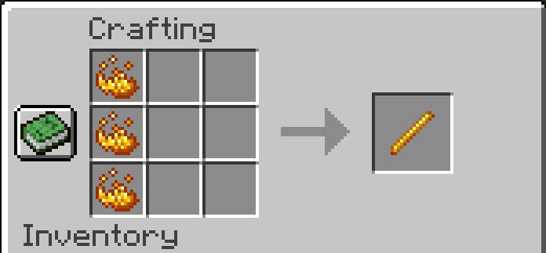
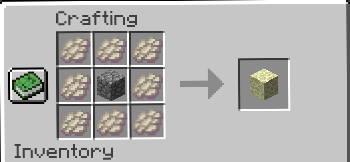
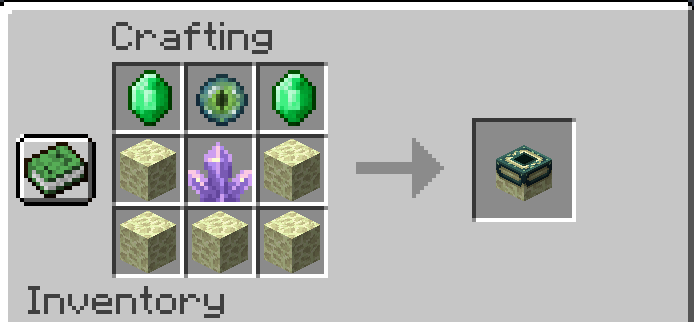
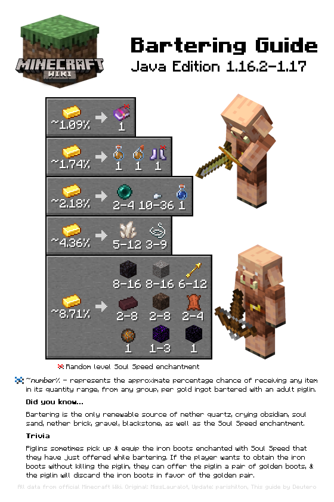

# world-border-challenge : Java edition

Hey ! I create a datapack that change crafting and bartering to make this challenge more fun (and accessible)

## Crafting

 

## BATERING

This is the **current trade** you can have with piglin!

What is added : 

1. blaze_powder => 1.74%
2. nether_wart => 2.18%

the rest is the same !

 

## How to :

### **Add to already existing World**

1. press windows + R (or go to .minecraft)
2. find your world in **saves** folder
3. take **world-border-challenge-datapack** and put it in **datapack** folder
4. go in your world
5. type `/datapack list`
    -    **world-border-challenge-datapack** should appear in red,  
    - if in green, no need to do the next step
6. type `/datapack enable  **world-border-challenge-datapack** `
7. type `/reload`, just to be sure

 

### **Add during creation**
1. When creating a minecraft world **data packs** button should appear ! go in and **open pack folder**
2. just copy **world-border-challenge-datapack** in the folder
3. create your world ! 
    - just to be sur that everything is alright. Follow step 5 of  **Already existing**

 

### **World border creation**

in game type :
1. choose a location you want !
2. `/worldborder center ~ ~ ~`
3. `/worldborder set 100` 
4. Enjoy

if you want more info check this : https://minecraft.fandom.com/wiki/Commands/worldborder

---

ps : I made it for my **minecraft Java** so i don't know if it works on bedrock. Well, if you have any suggestions for improvement or ideas, go for it!
I'm new to this "minecraft dev", if you can call it that way, so any resources can be helpful! 

